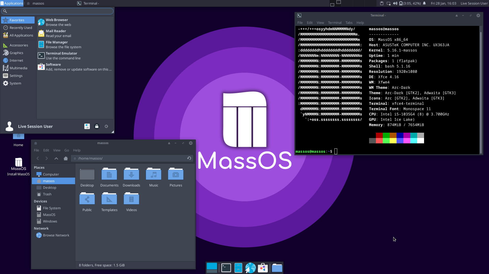

# About MassOS
MassOS is a free (as in [freedom](https://www.gnu.org/philosophy/free-sw.html)) GNU/Linux operating system for laptops and desktops which is designed to be minimal and lightweight, without compromising on features.

MassOS uses a themed Xfce desktop environment. This allows it to be lightweight on system resources while still being visually appealing and easy to use.

Unlike the majority of GNU/Linux distributions, MassOS is **completely independent** and **built from scratch**. This means it is free from being chained down to distributions outside of our control.

Compared to other distributions, MassOS boasts the absolute latest and greatest in software. For example: MassOS was one of the first distributions in existence to support OpenSSL 3 and FFmpeg 5 in the official stable release (i.e. not marked as BETA/unstable).

Additionally, updates for MassOS are provided twice a month, so your system will never become out of date. Updating is also optional, and updates are never forced on you.

MassOS is easy to get started with. With a 2GB USB flash drive, you can use the Live ISO to try out MassOS without making any changes to your computer, and see if it's right for you before you decide to fully install it onto your PC. If you do decide to install it, you can install it alongside your current operating system, or replace it entirely.

See [Installing MassOS](https://github.com/MassOS-Linux/MassOS/wiki/Installing-MassOS) for information on how to try out MassOS and install it onto your computer. You can view the release notes for, and download the latest release of MassOS from the [Releases Page](https://github.com/MassOS-Linux/MassOS/releases).
