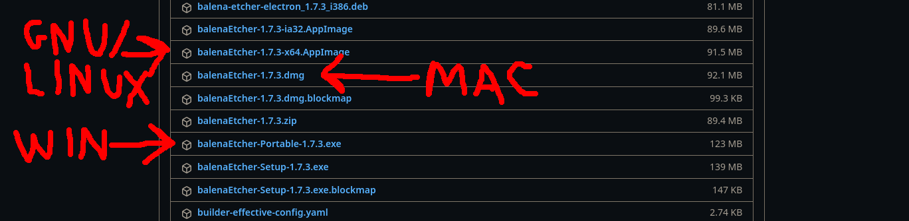
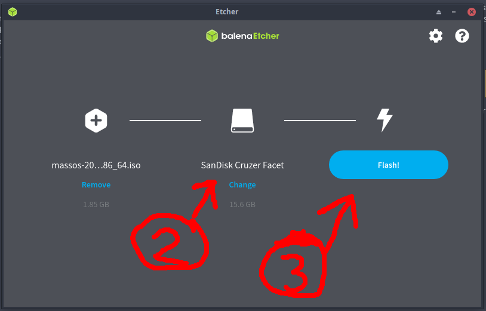
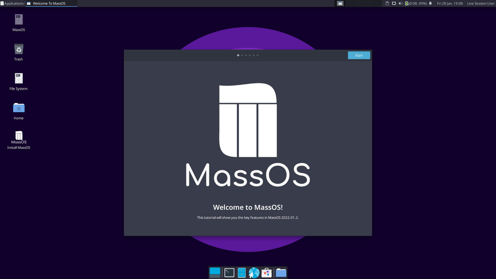
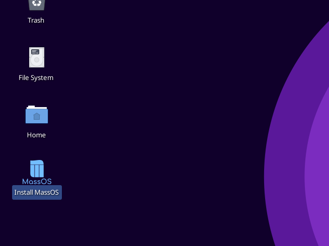

# Installation Guide
This page will guide you through the installation process of MassOS using the Live CD ISO file.

Before installing, you may wish to read [About MassOS](https://github.com/MassOS-Linux/MassOS/wiki/About-MassOS) to find out more about the operating system, what its goals are, and its differences compared to other distributions of GNU/Linux.

**NOTE:** This guide is dedicated to installing MassOS using the Live CD ISO file. To upgrade a MassOS installation, see [Upgrading MassOS](https://github.com/MassOS-Linux/MassOS/wiki/Upgrading-MassOS). To repair a MassOS installation, see [Repairing MassOS](https://github.com/MassOS-Linux/MassOS/wiki/Repairing-MassOS). To install MassOS manually, see [Manual Installation](https://github.com/MassOS-Linux/MassOS/wiki/Manual-Installation). To build MassOS from source, see [Building MassOS](https://github.com/MassOS-Linux/MassOS/wiki/Building-MassOS).
# System Requirements
- A 64-bit Intel/AMD CPU (most computers from the last ~15 years have a 64-bit CPU).
- At least 8GB of free disk space (16GB+ recommended).
- At least 1GB of RAM (2GB+ recommended).
- An empty flash drive of at least 2GB for the live environment and installer.
- Minimum 1024x768 screen resolution (some programs won't display properly below this and the UI will generally be hard to use and navigate). If you are using VirtualBox, we strongly recommend enabling EFI from VM Settings --> System, to increase the default resolution.

# Downloading MassOS
Head to the [Releases](https://github.com/MassOS-Linux/MassOS/releases) page to download the latest version of MassOS. From there you can also view the release notes for the latest version of MassOS.

## Which file to download?
While the main MassOS system is made up of only free software, we supplement our main ISO with some proprietary firmware "blobs" required to operate some hardware such as wireless, sound or graphics cards (found in `/usr/lib/firmware`). Because not everyone wants or needs this firmware, we offer two ISOs.

- Most users will want the standard ISO, labelled `massos-<VERSION>-x86_64.iso`. This contains the firmware described above.
- Some users may want the alternative ISO, labelled `massos-<VERSION>-x86_64-nofirmware.iso`. This contains no proprietary firmware. The only reasons to choose this are (a) if you absolutely refuse to use anything proprietary, and/or (b) you know for certain that your hardware does not require the firmware.

# Writing the ISO to a USB flash drive
This tutorial will show you how to use the [Etcher](https://www.balena.io/etcher/) utility to create a bootable USB flash drive using the ISO you have just downloaded. This is free software and cross-platform, so the process is very similar on Windows, macOS, and GNU/Linux.

1. Visit the [Etcher Releases Page](https://github.com/balena-io/etcher/releases/), and download the appropriate version for your operating system.

2. Run the downloaded executable. On GNU/Linux, you may need to first right click the file in the file manager, go to properties, and select "Allow this file to run as a program".

3. Choose "Flash from file" and browse to your downloaded ISO file.

4. Ensure your USB flash drive is selected, then click "Flash!" to begin the write process.

5. Wait patiently for the write to finish. Once it has finished, close Etcher. Your USB flash drive will then be bootable, and you can proceed to "Booting the live environment".

# Booting the live environment.
You'll need to restart your computer to be able to boot from your USB flash drive. To boot from the flash drive, you normally have to press a special key during startup (when you see the BIOS logo). This could be any of the following: Escape, F1, F2, F9, F10, F11, F12. If you are unsure, consult the manual for your system. If done successfully, MassOS will start up from your USB flash drive.

**NOTE:** If you are using UEFI and the boot fails, you may need to [disable secure boot](https://www.rodsbooks.com/efi-bootloaders/secureboot.html#disable) in your firmware settings.

After the live system has booted, you'll be shown a welcome screen like this:

This shows some of the key features in MassOS and how to navigate the OS.

You can use the live system to try out MassOS before you decide to install it.
# Starting the installation.
1. Launch the installation program found on the desktop to begin the installation of MassOS. If you get any sort of "Untrusted Executable" warning, simply select "Mark Executable" and continue.

2. Choose "Install" to start the installation.

3. Choose which disk you want to use for the installation. It should differ from the USB flash drive you used to create the bootable live environment.

4. Choose how you want to set up the disk. Option 1 will erase the whole disk and install MassOS. Option 2 will let you choose a partition to install MassOS on (for dual-booting). Option 3 will let you manually create and modify partitions.

5. If you selected option 2, select the partition you want to use for the root filesystem where MassOS will be installed.

6. Choose the filesystem you want to use for the root partition. If unsure, ext4 is recommended.

7. Decide whether you want to add a swap partition or not. Swap acts as an emergency RAM backup on the disk in case the system RAM gets full. It is designed to be used in emergency situations only and is not a RAM substitute. If you have less than 8 gigabytes of RAM, swap is advisable.

8. After setting up the disk, the installation will begin. This may take a few minutes to complete, so be patient.

9. After the installation completes, some initial setup will take place. This includes setting up the language, keyboard layout, timezone and user accounts. Follow the instructions given by the installer until the installation is complete.
10. After completing the installation, this message will be shown and then the system will reboot.

Remember to unplug the USB flash drive to ensure you boot into your new system instead of restarting the live environment.

# What next?
For general information on how to make the most out of your new installation, have a look at [Post-Installation](https://github.com/MassOS-Linux/MassOS/wiki/Post-Installation). It contains information on how to do things like install software, customise your desktop, amongst other useful tips.
