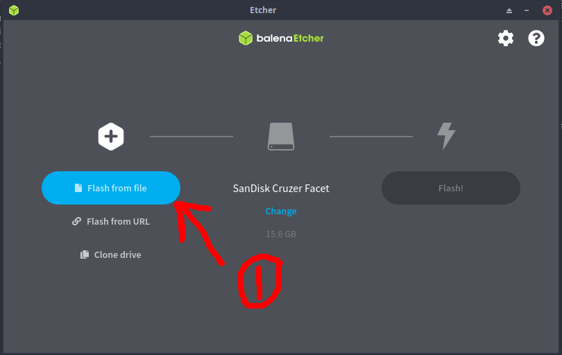
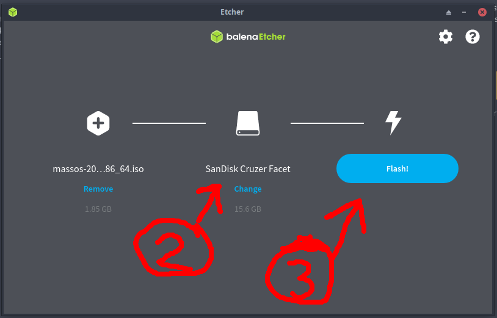
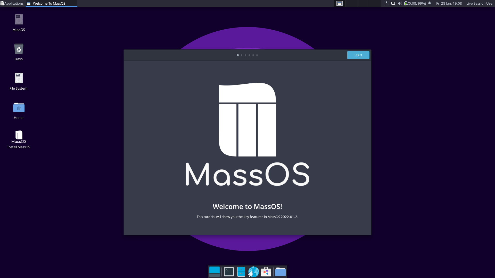
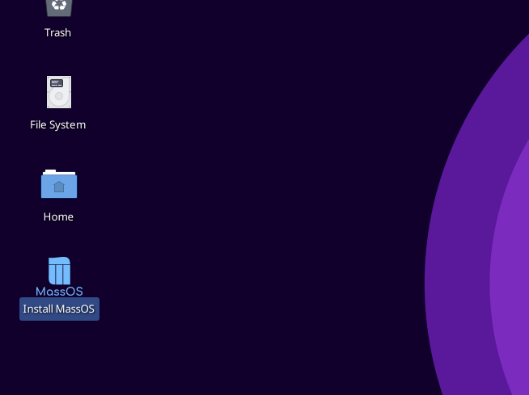
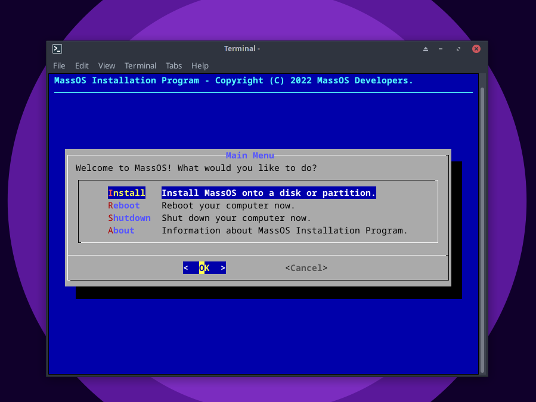
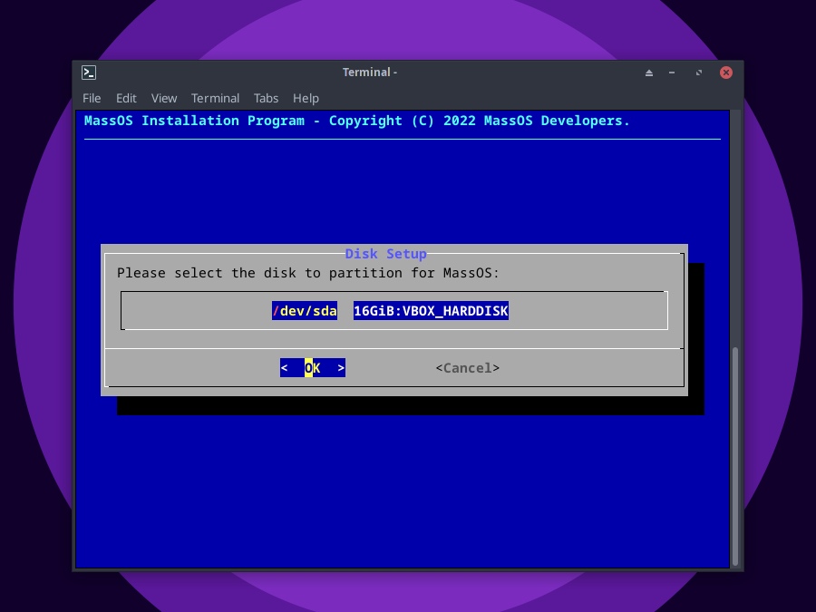

# Instrukcja instalacji
Ta strona poprowadzi Cię przez proces instalacji MassOS przy użyciu pliku ISO Live CD.

Przed instalacją możesz przeczytać [O MassOS](https://github.com/MassOS-Linux/MassOS/wiki/About-MassOS), aby dowiedzieć się więcej o systemie operacyjnym, jego celach i różnicach w porównaniu do innych dystrybucji GNU/Linuksa.

**UWAGA:** Ten przewodnik jest poświęcony instalowaniu MassOS przy użyciu pliku ISO Live CD. Aby zaktualizować instalację MassOS, zobacz [Upgrading MassOS](https://github.com/MassOS-Linux/MassOS/wiki/Upgrading-MassOS). Aby naprawić instalację MassOS, zobacz [Repairing MassOS](https://github.com/MassOS-Linux/MassOS/wiki/Repairing-MassOS). Aby zainstalować MassOS ręcznie, zobacz [Instalacja ręczna](https://github.com/MassOS-Linux/MassOS/wiki/Manual-Installation). Aby zbudować MassOS ze źródeł, zobacz [Building MassOS](https://github.com/MassOS-Linux/MassOS/wiki/Building-MassOS).
# Wymagania systemowe
- 64-bitowy procesor Intel/AMD (większość komputerów z ostatnich ~15 lat ma 64-bitowy procesor).
- Co najmniej 8 GB wolnego miejsca na dysku (zalecane 16 GB+).
- Co najmniej 1 GB pamięci RAM (zalecane 2 GB+).
- Pusty dysk flash o pojemności co najmniej 2 GB dla środowiska na żywo i instalatora.
- Minimalna rozdzielczość ekranu 1024x768 (niektóre programy nie będą wyświetlać się poprawnie poniżej tej wartości, a interfejs użytkownika będzie ogólnie trudny w użyciu i nawigacji). Jeśli korzystasz z VirtualBox, zdecydowanie zalecamy włączenie EFI w Ustawieniach maszyny wirtualnej --> System, aby zwiększyć domyślną rozdzielczość.

# Pobieranie MassOS
Wejdź na stronę [Wydania](https://github.com/MassOS-Linux/MassOS/releases), aby pobrać najnowszą wersję MassOS. Stamtąd możesz również wyświetlić informacje o wydaniu najnowszej wersji MassOS.

## Jaki plik do pobrania?
Podczas gdy główny system MassOS składa się wyłącznie z wolnego oprogramowania, uzupełniamy nasze główne ISO o niektóre zastrzeżone „bloby” oprogramowania sprzętowego wymagane do obsługi niektórych urządzeń, takich jak karty bezprzewodowe, dźwiękowe lub graficzne (znajdziesz je w `/usr/lib/firmware`) . Ponieważ nie każdy chce lub potrzebuje tego oprogramowania, oferujemy dwa obrazy ISO.

- Większość użytkowników będzie potrzebować standardowego ISO, oznaczonego `massos-<WERSJA>-x86_64.iso`. Zawiera oprogramowanie układowe opisane powyżej.
- Niektórzy użytkownicy mogą chcieć alternatywnego ISO, oznaczonego `massos-<WERSJA>-x86_64-nofirmware.iso`. To nie zawiera zastrzeżonego oprogramowania układowego. Jedynymi powodami, dla których warto to wybrać, są (a) jeśli absolutnie odmawiasz korzystania z jakichkolwiek prawnie zastrzeżonych produktów i/lub (b) wiesz na pewno, że Twój sprzęt nie wymaga oprogramowania układowego.

# Zapisywanie ISO na dysku flash USB
Ten samouczek pokaże Ci, jak używać narzędzia [Etcher](https://www.balena.io/etcher/) do tworzenia rozruchowego dysku flash USB przy użyciu właśnie pobranego obrazu ISO. Jest to darmowe oprogramowanie i wieloplatformowe, więc proces jest bardzo podobny w systemach Windows, macOS i GNU/Linux.

1. Odwiedź [Etcher Releases Page](https://github.com/balena-io/etcher/releases/) i pobierz odpowiednią wersję dla swojego systemu operacyjnego.

2. Uruchom pobrany plik wykonywalny. W systemie GNU/Linux może być konieczne kliknięcie prawym przyciskiem myszy pliku w menedżerze plików, przejście do właściwości i wybranie opcji „Zezwól temu plikowi na uruchamianie jako program”.

3. Wybierz „Flashuj z pliku” i przejdź do pobranego pliku ISO.

4. Upewnij się, że wybrany jest dysk flash USB, a następnie kliknij „Flash!” aby rozpocząć proces pisania.

5. Czekaj cierpliwie na zakończenie zapisu. Po zakończeniu zamknij Etchera. Twój dysk flash USB będzie wtedy bootowalny i możesz przejść do „Uruchamiania środowiska na żywo”.

# Uruchamianie środowiska na żywo.
Musisz ponownie uruchomić komputer, aby móc uruchomić komputer z dysku flash USB. Aby uruchomić komputer z dysku flash, zwykle musisz nacisnąć specjalny klawisz podczas uruchamiania (kiedy zobaczysz logo BIOS). Może to być dowolny z następujących elementów: Escape, F1, F2, F9, F10, F11, F12. Jeśli nie masz pewności, zapoznaj się z instrukcją obsługi swojego systemu. Jeśli zrobisz to pomyślnie, MassOS uruchomi się z dysku flash USB.

**UWAGA:** Jeśli używasz UEFI, a rozruch nie powiedzie się, może być konieczne [wyłączenie bezpiecznego rozruchu](https://www.rodsbooks.com/efi-bootloaders/secureboot.html#disable) w ustawieniach oprogramowania układowego .

Po uruchomieniu systemu live pojawi się następujący ekran powitalny:

To pokazuje niektóre z kluczowych funkcji w MassOS i jak poruszać się po systemie operacyjnym.

Możesz użyć systemu live, aby wypróbować MassOS, zanim zdecydujesz się go zainstalować.
# Rozpoczęcie instalacji.
1. Uruchom program instalacyjny znajdujący się na pulpicie, aby rozpocząć instalację MassOS. Jeśli otrzymasz jakiekolwiek ostrzeżenie „Niezaufany plik wykonywalny”, po prostu wybierz „Oznacz plik wykonywalny” i kontynuuj.

2. Wybierz „Zainstaluj”, aby rozpocząć instalację.

3. Wybierz dysk, którego chcesz użyć do instalacji. Powinien różnić się od dysku flash USB, którego użyłeś do utworzenia rozruchowego środowiska na żywo.

4. Wybierz, jak chcesz
