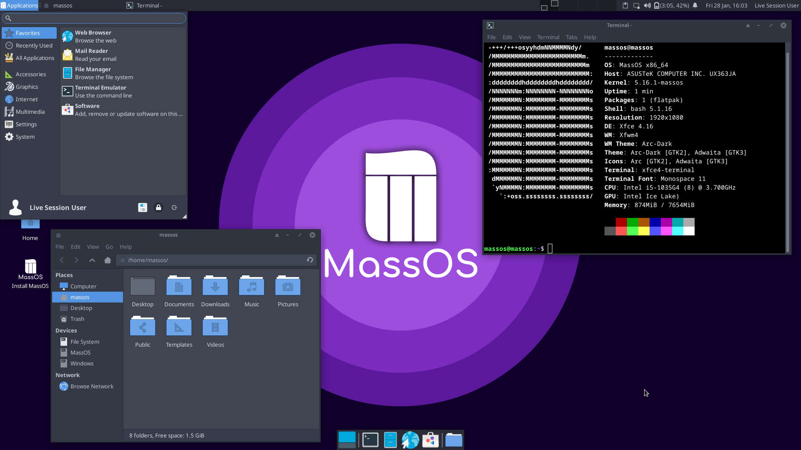

# O MassOS
MassOS to darmowy (jak w [wolność](https://www.gnu.org/philosophy/free-sw.html)) system operacyjny GNU/Linux dla laptopów i komputerów stacjonarnych, który został zaprojektowany tak, aby był minimalny i lekki, bez kompromisów na funkcje.

MassOS wykorzystuje tematyczne środowisko graficzne Xfce. Dzięki temu jest lekki w zasobach systemowych, a jednocześnie jest atrakcyjny wizualnie i łatwy w użyciu.

W przeciwieństwie do większości dystrybucji GNU/Linux, MassOS jest **całkowicie niezależny** i **zbudowany od podstaw**. Oznacza to, że nie może być przykuty do dystrybucji poza naszą kontrolą.

W porównaniu do innych dystrybucji, MassOS może pochwalić się absolutnie najnowszym i najlepszym oprogramowaniem. Na przykład: MassOS był jedną z pierwszych istniejących dystrybucji obsługujących OpenSSL 3 i FFmpeg 5 w oficjalnym wydaniu stabilnym (tj. nie oznaczonym jako BETA/niestabilny).

Dodatkowo aktualizacje dla MassOS są dostarczane dwa razy w miesiącu, więc Twój system nigdy nie będzie nieaktualny. Aktualizacja jest również opcjonalna, a aktualizacje nigdy nie są na ciebie wymuszane.

MassOS jest łatwy do rozpoczęcia. Dzięki pamięci flash USB o pojemności 2 GB możesz użyć Live ISO, aby wypróbować MassOS bez wprowadzania jakichkolwiek zmian na komputerze i sprawdzić, czy jest to odpowiednie dla Ciebie, zanim zdecydujesz się w pełni zainstalować go na swoim komputerze. Jeśli zdecydujesz się go zainstalować, możesz zainstalować go razem z obecnym systemem operacyjnym lub całkowicie go zastąpić.

Zobacz [Instalowanie MassOS](https://github.com/MassOS-Linux/MassOS/wiki/Installing-MassOS), aby dowiedzieć się, jak wypróbować MassOS i zainstalować go na swoim komputerze. Możesz wyświetlić informacje o wydaniu i pobrać najnowszą wersję MassOS ze [Strona wydań](https://github.com/MassOS-Linux/MassOS/releases).
