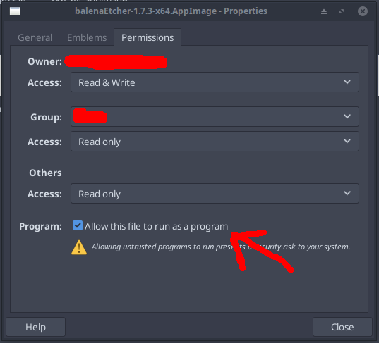

# Przewodnik po instalacji
Ten artykuł ma na celu dostarczenie informacji o tym, co zrobić po zainstalowaniu MassOS i jak najlepiej wykorzystać nowy system.
# Instalowanie oprogramowania
Istnieje wiele sposobów instalowania oprogramowania. Niektóre z nich zostały opisane w tym artykule.
## Flatpak
Flatpak to uniwersalny menedżer pakietów przeznaczony do dystrybucji aplikacji komputerowych w szerokiej gamie dystrybucji GNU/Linux. Jest instalowany i konfigurowany domyślnie w MassOS, co czyni go najwygodniejszym sposobem na uzyskanie nowych aplikacji.

Możesz instalować aplikacje Flatpak graficznie, korzystając z programu **Oprogramowanie** w MassOS, a także za pomocą wiersza poleceń.
### Graficzna instalacja aplikacji Flatpak
Centrum oprogramowania na MassOS (oprogramowanie GNOME) można uruchomić z menu aplikacji lub z panelu u dołu ekranu:

Przy pierwszym uruchomieniu pobranie danych aplikacji może zająć kilka sekund. Po otwarciu strona główna sklepu zawiera kilka polecanych aplikacji. Możesz przeglądać kategorie lub kliknąć przycisk wyszukiwania w lewym górnym rogu:

Na przykład: Aby zainstalować LibreOffice, wyszukamy go:

Teraz kliknij "Zainstaluj" i czekaj cierpliwie. Po zainstalowaniu aplikacja będzie dostępna na liście aplikacji. Możesz go również uruchomić, klikając przycisk „Uruchom” w centrum oprogramowania.

### Instalowanie aplikacji Flatpak z terminala
Możesz także zainstalować aplikacje Flatpak z terminala.

Naciśnij klawisze Control+Alt+T, aby otworzyć terminal, lub znajdź terminal na liście aplikacji.

Możesz wpisać następujące polecenie, aby zainstalować oprogramowanie Flatpak:
```
flatpak install <nazwa pakietu>
```
Na przykład, aby zainstalować LibreOffice:
```
flatpak install org.libreoffice.LibreOffice
```
Aby wyszukać oprogramowanie, zamień `install` na `search`:
```
flatpak search <wyszukiwane pakiet>
```
Aby wyświetlić listę zainstalowanego oprogramowania:
```
flatpak list
```
## AppImages
AppImages to aplikacje dla systemu Linux, które łączą wszystkie swoje zależności w jeden przenośny plik wykonywalny, który można uruchomić z niemal dowolnego miejsca.

Wiele popularnych projektów, w tym Kdenlive i Krita, udostępnia AppImages na swoich stronach pobierania. Istnieją również setki stworzonych przez społeczność AppImages dla innych popularnych aplikacji, takich jak Atom, Arduino, Blender, Chromium, GIMP i wielu innych dostępnych w [AppImageHub] (https://appimage.github.io).

Po pobraniu pliku AppImage wystarczy ustawić go jako plik wykonywalny, a następnie uruchomić. Aby utworzyć plik wykonywalny AppImage, po prostu kliknij plik prawym przyciskiem myszy, przejdź do „Uprawnienia” i zaznacz „Zezwalaj temu plikowi na uruchamianie jako program”.

