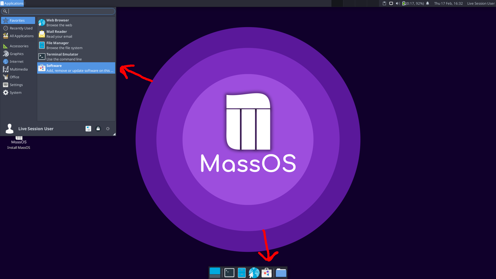
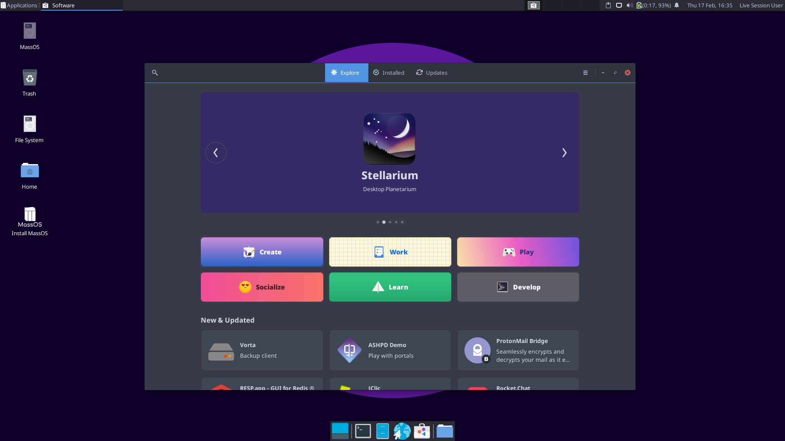
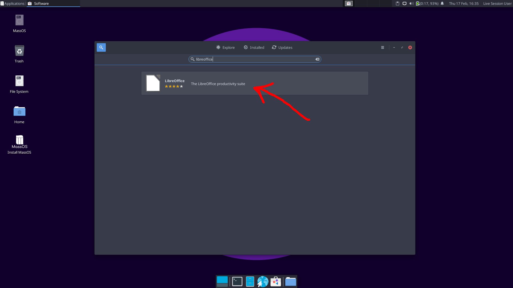
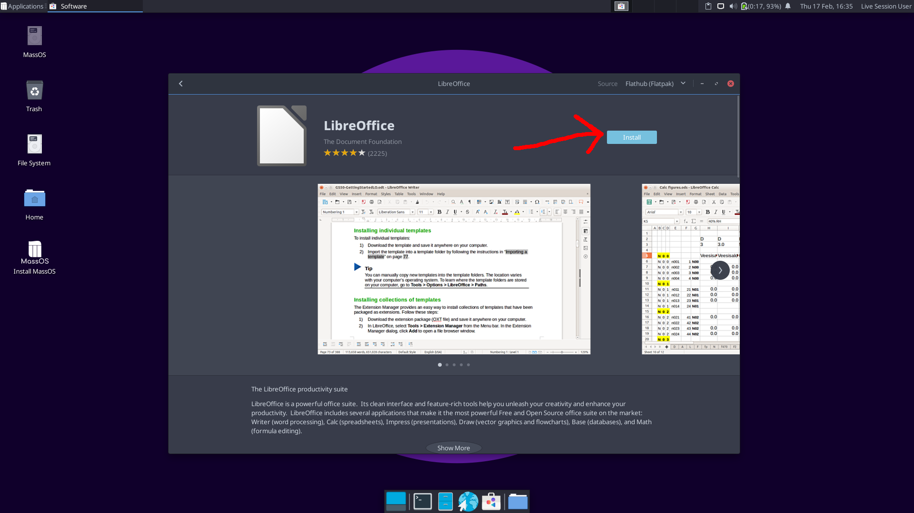

# Post-Installation Guide
This article aims to give you some information on what to do after installing MassOS and how to make the most out of your new system.
# Installing Software
There are multiple ways you can install software. Some of these are described in this article.
## Flatpak
Flatpak is a universal package manager designed for distributing desktop applications across a wide variety of GNU/Linux distributions. It is installed and configured by default on MassOS, making it the most convenient way to get new apps.

You can install Flatpak apps graphically, using the **Software** program on MassOS, as well as via the command-line.
### Graphically installing Flatpak apps
The software center on MassOS (GNOME Software) can be launched from the applications menu, or from the panel at the bottom of the screen:

On the first launch, it may take a few seconds to download application data. Once open, the front page of the store contains some recommended apps. You can browse through the categories, or click the search button at the top left hand corner:

For example: To install LibreOffice, we will search for it:

Now click "Install" and wait patiently. When the app is installed, it will be available from your apps list. You can also launch it by clicking the "Launch" button in the software center.

### Installing Flatpak apps from the terminal
You can also install Flatpak apps from the terminal.

Press Control+Alt+T to open a terminal, or find the terminal in your apps list.

You can type the following command to install Flatpak software:
```
flatpak install <name of package>
```
For example, to install LibreOffice:
```
flatpak install org.libreoffice.LibreOffice
```
To search for software, replace `install` with `search`:
```
flatpak search <search term>
```
To list installed software:
```
flatpak list
```
## AppImages
AppImages are Linux apps which bundle all their dependencies into a single portable executable which can be run from almost anywhere.

Many popular projects including Kdenlive and Krita provide AppImages on their download pages. There are also hundreds of community-built AppImages for other popular applications like Atom, Arduino, Blender, Chromium, GIMP and many more available from [AppImageHub](https://appimage.github.io).

After downloading an AppImage file, all you have to do is make it executable, and then run it. To make an AppImage executable, simply right click the file, go to "Permissions", and check "Allow this file to run as a program".

