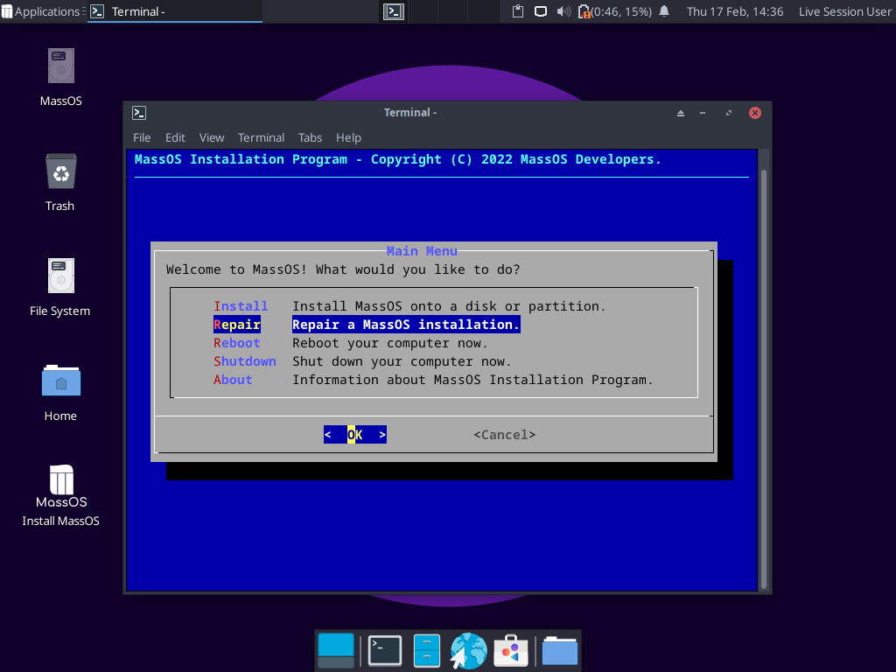
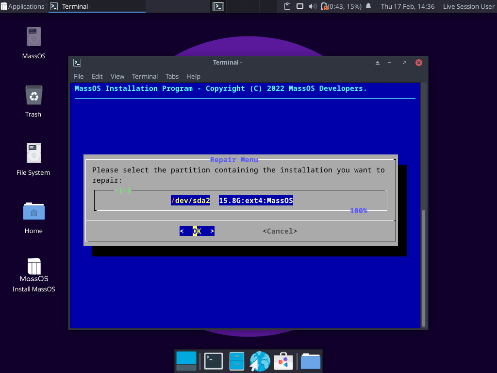
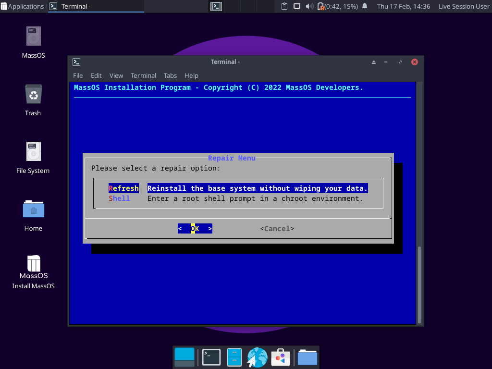
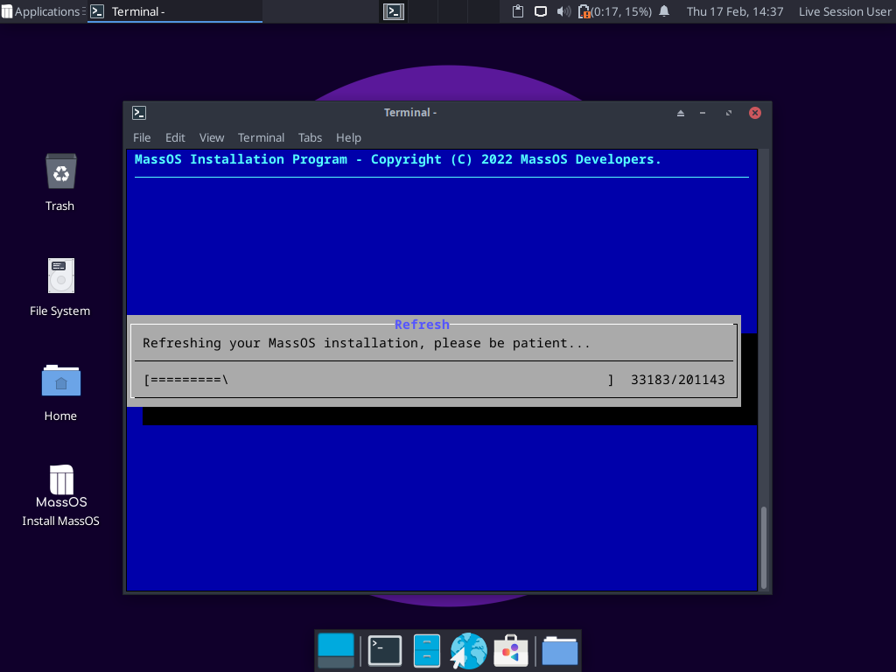
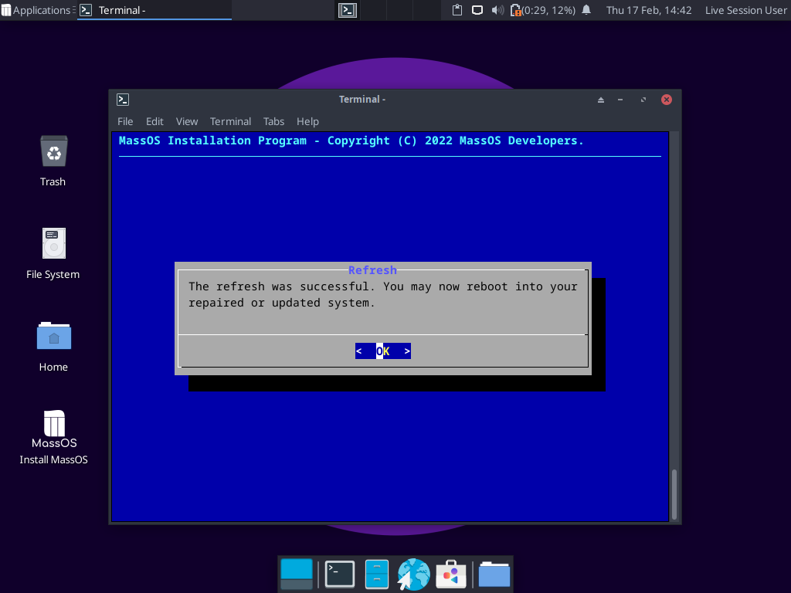

# Upgrading MassOS
New versions of MassOS are typically released once or twice a month. This article will show you how to upgrade a MassOS installation without needing to reinstall for a new version.
# Pre-Upgrade notes
There are two ways to upgrade a MassOS system. The former is easier, however the latter is much faster and more robust.

Before upgrading, it is highly recommend that you back up your device and have an emergency/recovery boot device available, in the (unlikely) event that something goes wrong or the process gets unexpectedly interrupted, and your system becomes unusable.
# Method 1 - The upgrade utility
This method is the easiest, and takes place from within a running MassOS system. When core system components such as the C library are updated, it may not always be possible. If not, try method 2 (below) instead.
## During the upgrade
- Do not attempt to run any other programs/tasks in the background. If you already have other programs running, save and close them before continuing, as the upgrade may cause them to crash.
- Ensure the system powered on. If it's a laptop, ensure the charger is plugged in; don't rely on battery power.
- Do not allow the system to sleep or hibernate. If you aren't able to manually keep the system awake, go to **Power Manager** settings and set the "blank screen" and "suspend" options to "Never".
- Be patient. Some stages may take a **very** long time with no verbose output, however the upgrade is still working! Allow at least 30 minutes for the entire upgrade to complete. If you really can't be patient, try method 2 (below) instead, which is faster.

## Retrieving the upgrade utility
Run the following command to retrieve the MassOS upgrade utility:
```
curl -Os https://raw.githubusercontent.com/MassOS-Linux/massos-upgrade/main/massos-upgrade
chmod 755 massos-upgrade
```
## Run the upgrade utility
The upgrade utility must be run as **root**. If logged in as a regular user, invoke it with `sudo`:
```
sudo ./massos-upgrade
```
The utility will check for a new release of MassOS. If there is one, it will show you some details about the new version, and show a confirmation prompt as to whether you wish to upgrade or not. Answer with `y` to confirm and start the upgrade.

The utility will then proceed to download the upgrade package, prepare the upgrade, and then install the upgrade. As mentioned above, this may take a **very** long time with little to no output, so be extremely patient; the upgrade is still working!
## After the upgrade completes
After the upgrade finishes, you MUST reboot your system before doing anything further.
# Method 2 - Refreshing from the Live CD ISO
This method is faster and often safer than the previous method, since the system being upgraded is not running during the upgrade.

To upgrade using this method, you need to boot a Live environment of the MassOS version you want to upgrade to. See [Installing MassOS](https://github.com/MassOS-Linux/MassOS/wiki/Installing-MassOS) for information on how to make and use a bootable USB.

Once you've booted into the live environment, do the following steps:

1. Open the installer and choose the repair option:

2. Select the partition containing the installation you want to upgrade:

3. Select **Refresh**:

4. Confirm the action then wait patiently for the upgrade to complete. This shouldn't take too long:

5. Once the upgrade has finished, you can reboot into your upgraded system. Remember to remove the USB flash drive so you boot into your system rather than rebooting the live environment:


# Post-upgrade tips
## Configuration files
Some configuration files in `/etc` may have changed. If they have, they will not be overwrite your existing files in there by default, to ensure that user modifications to these files are not lost. For each changed file, it will be installed with a `.new` file ending. For each file, you can **completely optionally** decide whether to manually overwrite the existing file with the `.new` file, merge them some other way, or discard them completely. **If you do decide to do any of these, NEVER overwrite the files which have names similar to `/etc/group` or `/etc/passwd`, otherwise your system may break.**
## Removing the old kernel
Once the upgrade finishes, you will have two kernels installed, one being the older one. If the newer kernel works for you, you can delete the older one with the following steps. **This is completely optional.**

First, check which kernels are installed by running the following command:
```
ls /usr/lib/modules
```
You should see two or more kernels here, one being the older one. For example, if you have just upgraded from 2022.02 to 2022.02.2, the old kernel will be `5.16.4-massos`, and the new kernel will be `5.16.10-massos`, so the one to remove will be `5.16.4-massos`. Run `uname -r` if you want to check which kernel is currently booted.

**NOTE:** In all the following commands `<kernel-version>` is a placeholder for the kernel version to remove, e.g. `5.16.4-massos`. Do not include the angled brackets in the commands, those are just there to show placeholders. **Also ensure the kernel version you're removing is correct, removing the wrong kernel could prevent your system from booting.**

First, remove the kernel, initramfs, config and System.map files associated with the kernel:
```
sudo rm -f /boot/{vmlinuz,initrd.img,config,System.map}-<kernel-version>
```
Now remove the directory containing the kernel modules:
```
sudo rm -rf /usr/lib/modules/<kernel-version>
```
Lastly, regenerate your GRUB configuration file to ensure that the removed kernels are not shown as menu options when booting:
```
sudo grub-mkconfig -o /boot/grub/grub.cfg
```
If you're using an alternative bootloader such as systemd-boot, you'll need to update the bootloader configuration file(s) manually as appropriate.
